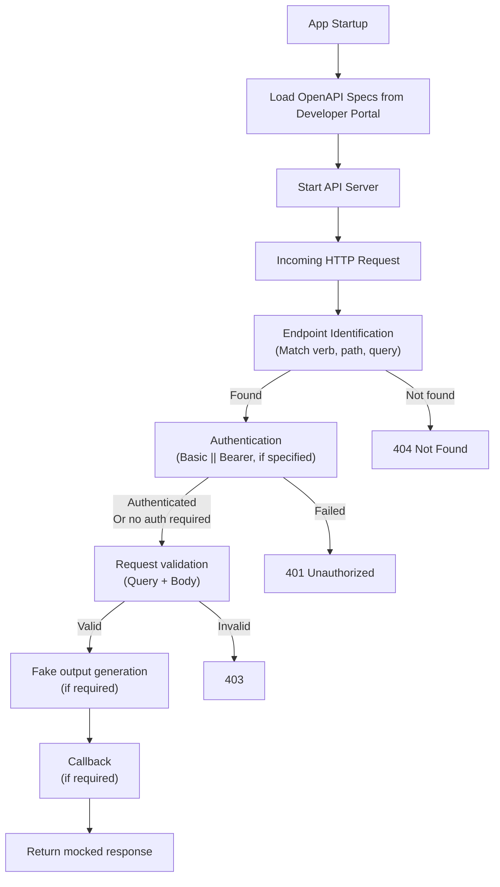

[](https://github.com/Vonage-Community/tool-docker-api-sandbox/actions/workflows/build.yml/badge.svg)
[](CODE_OF_CONDUCT.md)

# Vonage API Sandbox

The Vonage API Sandbox provides a local environment that simulates our APIs.

It is designed for:
* Integrating Vonage APIs without making real API calls
* Validating OpenAPI specifications
* Testing unreleased APIs by using local specs

## How it works

The Sandbox is an API with no endpoints.

At startup, it:
* Loads OpenApi specifications from our [Developer Portal](https://developer.vonage.com/en/home)
* Starts a server that emulates APIs based on these specifications

When a request is received, it goes through a series of middlewares:



> No account is required when using the sandbox.
> If Basic or Bearer authentication is expected by an endpoint, simply include a non-empty header.
> Any random value will work; no real credentials required.

## How to run the API Sandbox locally using Docker Images

> The docker image is, for the moment, published under a private DockerHub account.
> It will be moved under a Vonage acount shortly.

The API Sandbox is available as a Docker Image on [Docker Hub](https://hub.docker.com/repository/docker/tr00d/openapiexperiment-api/general).

Simply running `docker run tr00d/openapiexperiment-api:latest` **won't fully enable the sandbox**, as it requires additional configuration.
You need to specify certain parameters for networking, port exposure, and optional overrides.

| Parameter        | Mandatory |                                                                       Why?                                                                       |                    Example                    |
|------------------|-----------|:------------------------------------------------------------------------------------------------------------------------------------------------:|:---------------------------------------------:|
| Port             | Yes       |                                     The port on which the API will be exposed. Required for external access.                                     |                 -e PORT=10000                 |
| network          | Yes       |   Specifies which network stack the container must use. It must be set to `host` to share network interfaces and ports with the host machine.    |                --network=host                 |
| CLEAR_SPECS      | No        | If set to `true`, removes all default specs from the sandbox instance. Recommended when working on a single overridden spec. Default is `false`. |              -e CLEAR_SPECS=true              |
| SPEC_SMS         | No        |         Specifies a custom file for the SMS API. Can be either a public URI or a local file path. If not set, the default spec is used.          |   -e SPEC_SMS=http://example.com/spec.json    |
| SPEC_APPLICATION | No        |     Specifies a custom file for the Application API. Can be either a public URI or a local file path. If not set, the default spec is used.      | -e SPEC_APPLICATION=C:\Temp\application.json  |
| SPEC_VOICE       | No        |        Specifies a custom file for the Voice API. Can be either a public URI or a local file path. If not set, the default spec is used.         | -e SPEC_VOICE=/home/user/Documents/voice.json |
| SMS_DLR          | No        |                       Defines the callback URL for receiving SMS delivery receipts. If not set, no callbacks will be sent.                       |   -e SMS_DLR=http://localhost:8080/sms/dlr    |

### Basic Example: Running the Sandbox Locally
This command runs the sandbox on port `10000`.

```shell
sudo docker run --rm -e PORT=10000 --network=host tr00d/openapiexperiment-api:latest
```

### Example: Running the Sandbox with an SMS Delivery Receipt Callback
To specify a callback URL for receiving SMS delivery receipts.

```shell
sudo docker run --rm -e PORT=10000 -e SMS_DLR=http://localhost:9000/api/webhook --network=host tr00d/openapiexperiment-api:latest
```

### Example: Running the Sandbox with a Custom OpenAPI Spec for SMS
This command runs the sandbox with a **custom OpenAPI spec** for the SMS API.

```shell
sudo docker run --rm -e PORT=10000 --network=host -e SPEC_SMS=/home/{user}/Documents/Specs/sms.json tr00d/openapiexperiment-api:latest
```

### Example: Running the Sandbox Only with a Custom OpenAPI Spec for SMS
This command runs the sandbox with **only** a custom OpenAPI spec for the SMS API.
This improves performance but **removes all other default product specs**.

```shell
sudo docker run --rm -e PORT=10000 --network=host -e SPEC_SMS=/home/{user}/Documents/Specs/sms.json -e CLEAR_SPECS=true tr00d/openapiexperiment-api:latest
```

## How to run the API Sandbox for your Integration Tests

You can use [TestContainers](https://dotnet.testcontainers.org/) to start up the container during your integration tests.

### Install the TestContainers dependency

Make sure your test project has the following package:

```shell
dotnet add package DotNet.Testcontainers
```

### Configure the Container in your Tests

Create a test fixture that will start the container before your tests, and stops it after.

```csharp
private readonly IContainer container = new ContainerBuilder()
        .WithImage("tr00d/openapiexperiment-api:latest")
        .WithEnvironment("PORT", "10000")
        .WithPortBinding(10000, 10000)
        .WithWaitStrategy(Wait.ForUnixContainer().UntilHttpRequestIsSucceeded(strategy => strategy
            .ForPort(10000)
            .ForPath("/_/health")
            .ForStatusCode(HttpStatusCode.OK)))
        .Build();
```

> The configuration may vary depending on your operating system. On Windows, you will have to use port binding, as shown above. On Linux, you will require `.WithNetwork("host")` instead.

The fixture must implement the `IAsyncLifetime` interface to automatically start and stop the container:

```csharp
public async Task InitializeAsync()
{
    await this.container.StartAsync();
}

public async Task DisposeAsync()
{
    await this.container.StopAsync();
}
```

### Target the container and run your tests

The API Sandbox will be exposed on the port `10000` as shown above.

You can write a simple test to verify that you get a response from the `health` endpoint:

```csharp
[Fact]
public async Task HealthCheckTest()
{
    using var httpClient = new HttpClient();
    var response = await httpClient.GetAsync("http://localhost:10000/_/health");
    response.StatusCode.Should().Be(HttpStatusCode.OK);
}
```

## Supported APIs

| API                  | Supported? |
|----------------------|:----------:|
| Applications API     |     ✅      |
| Emergency API        |     ✅      |
| IdentityInsights API |     ✅      |
| Messages API         |     ✅      |
| SimSwap API          |     ✅      |
| SMS API              |     ✅      |
| Verify V2 API        |     ✅      |
| Voice API            |     ✅      |

## Contributing

See our [Contributing guide](CONTRIBUTING.md).